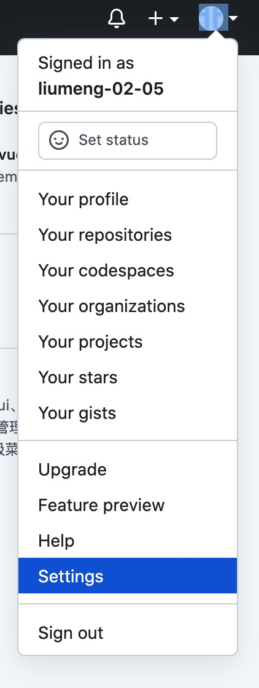
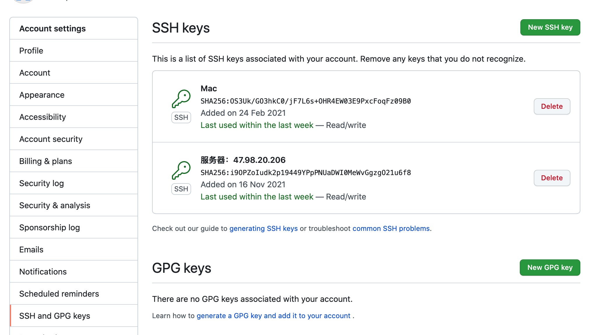
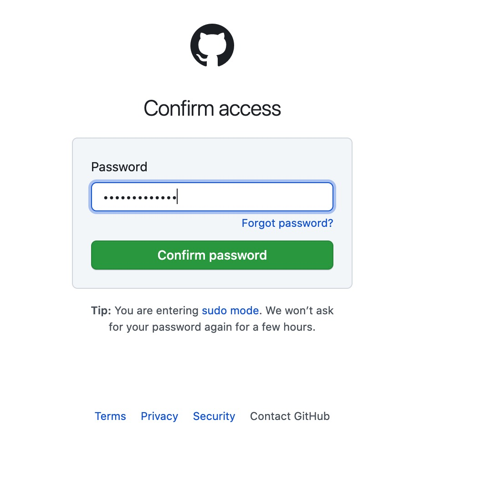
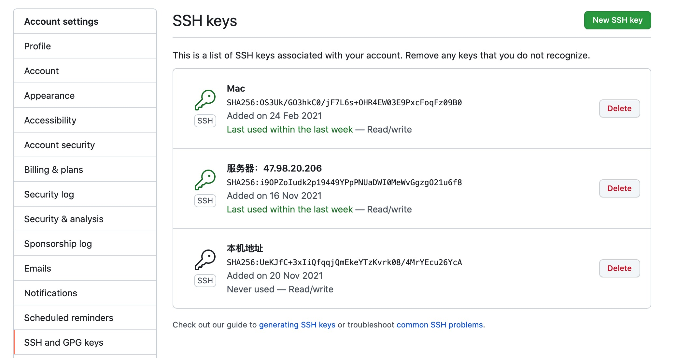

# 配置 SSH 密钥
> Gitee 添加密钥的方式和 Github 方式相同，这里以 Github 为例演示。[Gitee 添加 SSH 公钥地址:](https://gitee.com/profile/sshkeys)

## Mac

1. 查看本地是否存在密钥文件,如果存在 id_rsa 和 id_rsa.pub 表示存在密钥文件直接执行第三步

```bash
liumeng@liumengdeMacBook-Pro ~ % cd ~/.ssh/
liumeng@liumengdeMacBook-Pro .ssh % ll
total 56
drwxrwxrwx    7 liumeng  staff    224  4 22  2020 ./
drwxrwxrwx+ 107 liumeng  staff   3424 11 20 16:54 ../
drwxr-xr-x   11 liumeng  staff    352  6  1  2020 .git/
-rw-r--r--    1 liumeng  staff  12288  4 21  2020 .id_rsa.pub.swp
-rw-------    1 liumeng  staff   2602  7 26 15:48 id_rsa
-rw-r--r--    1 liumeng  staff    571  2 24  2021 id_rsa.pub
-rwxrwxrwx    1 liumeng  staff   5124 11 16 13:29 known_hosts*
liumeng@liumengdeMacBook-Pro .ssh %
```
2. 执行生成 SSH 密钥命令，根据提示按 Enter 键盘
> 我本地已经存在了 SSH 密钥文件，所以重新成时会提示是否重新生成 ‘Overwrite’，你们在本地直接按 Enter 键就可以了
```bash
ssh-keygen -t rsa -C 你的邮箱地址

liumeng@liumengdeMacBook-Pro .ssh % ssh-keygen -t rsa -C xx@qq.com
Generating public/private rsa key pair.
Enter file in which to save the key (/Users/liumeng/.ssh/id_rsa):
/Users/liumeng/.ssh/id_rsa already exists.
Overwrite (y/n)? y
Enter passphrase (empty for no passphrase):
Enter same passphrase again:
Your identification has been saved in /Users/liumeng/.ssh/id_rsa.
Your public key has been saved in /Users/liumeng/.ssh/id_rsa.pub.
The key fingerprint is:
SHA256:UeKJfC+3xIiQfqqjQmEkeYTzKvrk08/4MrYEcu26YcA xx@qq.com
The key's randomart image is:
+---[RSA 3072]----+
| +.     . .      |
|=..  o o +       |
|o+  o o =        |
|.o.o . o =       |
|+E+ o o S =      |
|o= o o   + .     |
|+ +.+     .      |
|o+o==o           |
|oo*=o*+          |
+----[SHA256]-----+
```
3. 打开密钥文件 : cat id_rsa.pub，复制密钥文件的内容

```bash
liumeng@liumengdeMacBook-Pro .ssh % cat id_rsa.pub
ssh-rsa AAAAB3NzaC1yc2EAAAADAQABAAABgQDEGa2eN5Wvw0u00E16b6Jwo2d1+1AeuIuC+Y/+2myFidqeCKCwSpxcmG6nPV1HLCwE4e98sH37rgejm1Cz7OW/2HB+pKSEtSmObWsHSCAtoYJxn6ZhQgp70FudupgwjnryKZJKbDp3y8cHRd09RQ7kZFhxvPbWtHou5t5YM5y3V1EwAJ/BEQHhuFHR/d4Ukeo334M3dJR5qmEPqrypxnRAkJ11WrO7ArnEmFPLGhO3YXWPpF5q4YeCcvJwWZPOJj1GJIlY2KUMWCMcejVqCEVWgLIpuxXZ4Ydb8wnbCSD7BaE98Y6t3jVT5OHlQ0Q7H5FasO/pTGiCPg2yfoJHbvIn57oklY+3rB...
```
4. 登录 Github 账号，点击头像选择 Settings

5. 进去后选择 SSH and GPG keys, 点击右侧的 New SSH key ，添加密钥

6. 输入密钥名称，将 id_rsa.pub内容拷贝到 Key 中

7. 点击 Add SSH key 添加密钥，输入 Github 账户密码

8. 登录之后可以在界面看到新添加的密钥信息


## windows
> windows 下添加 Github 密钥命令和 Mac 相同，可以通过 Git Bash 生成 SSH 密钥文件。 [Git Bash 下载地址：](https://git-scm.com/downloads)