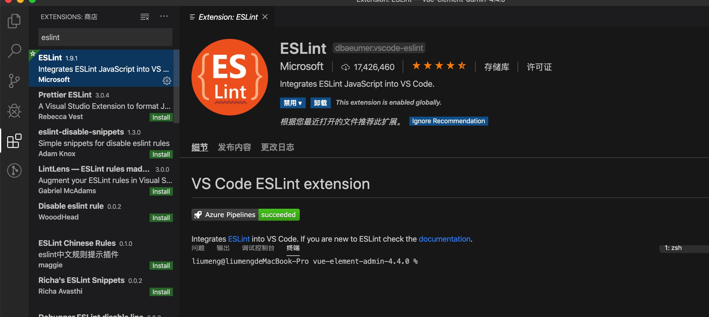
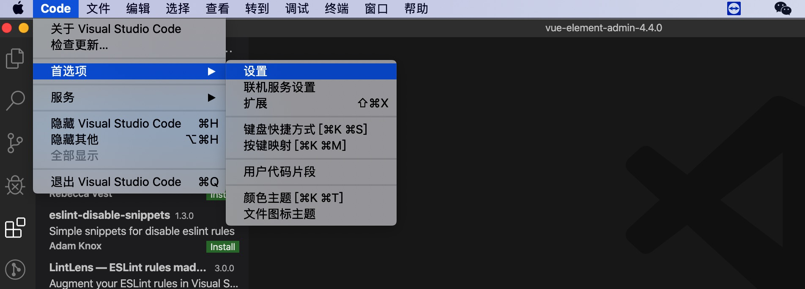
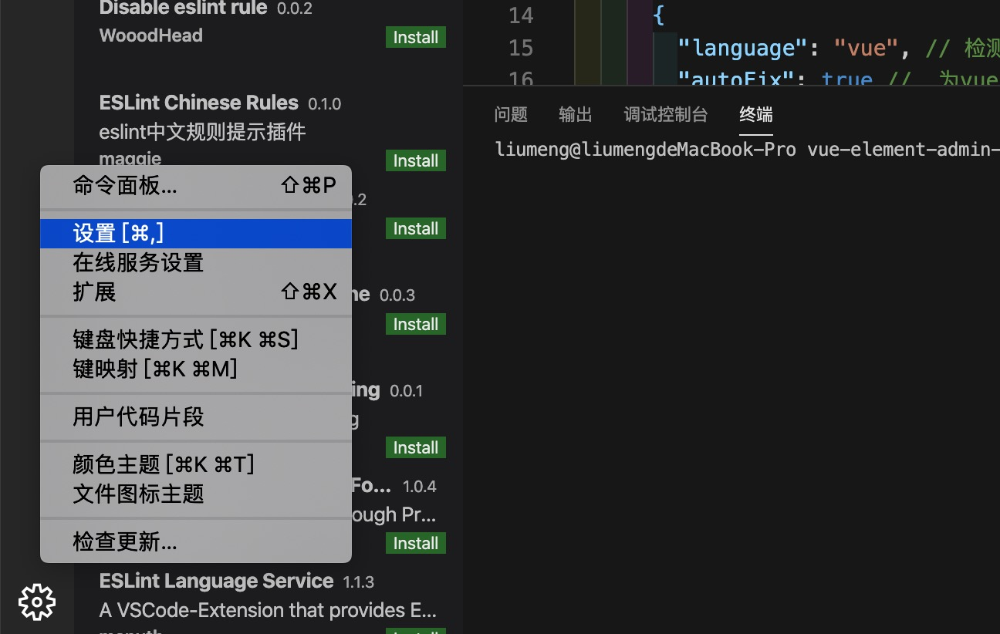
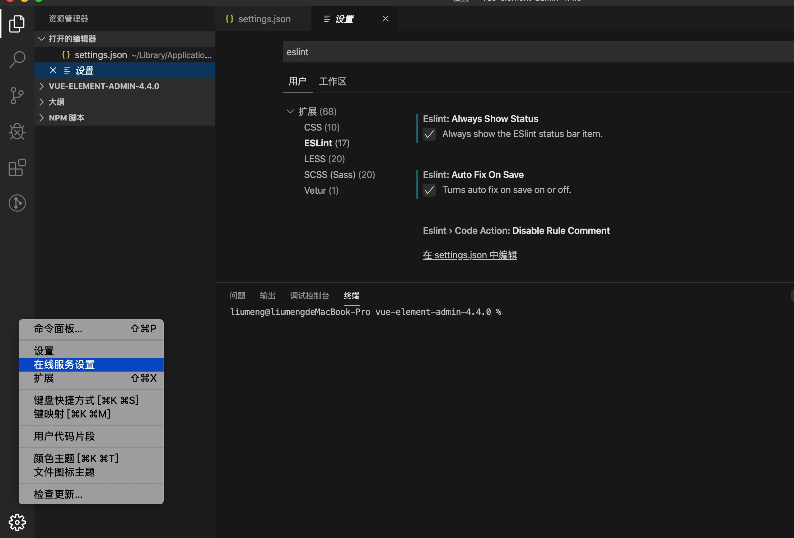
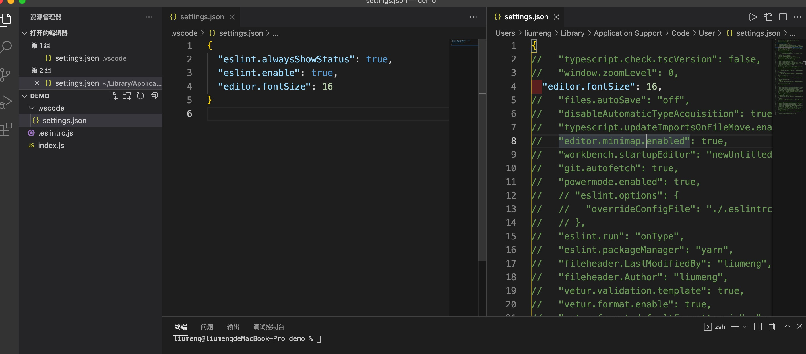
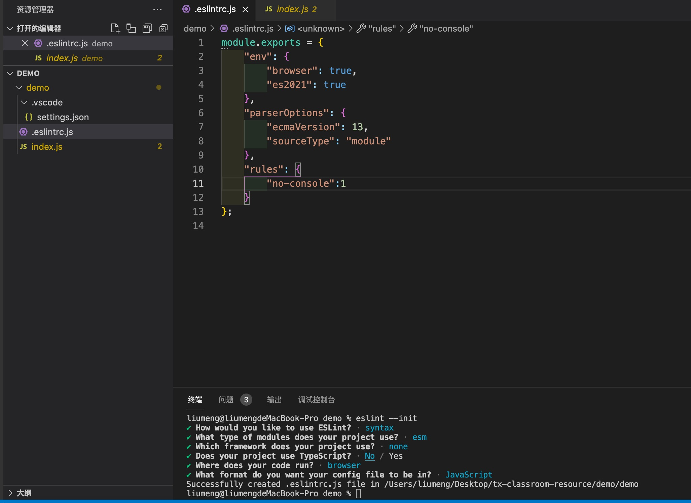
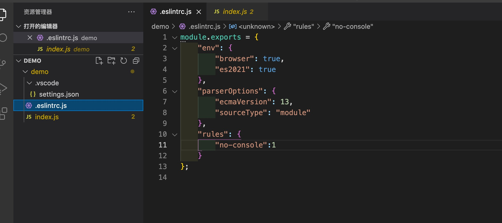
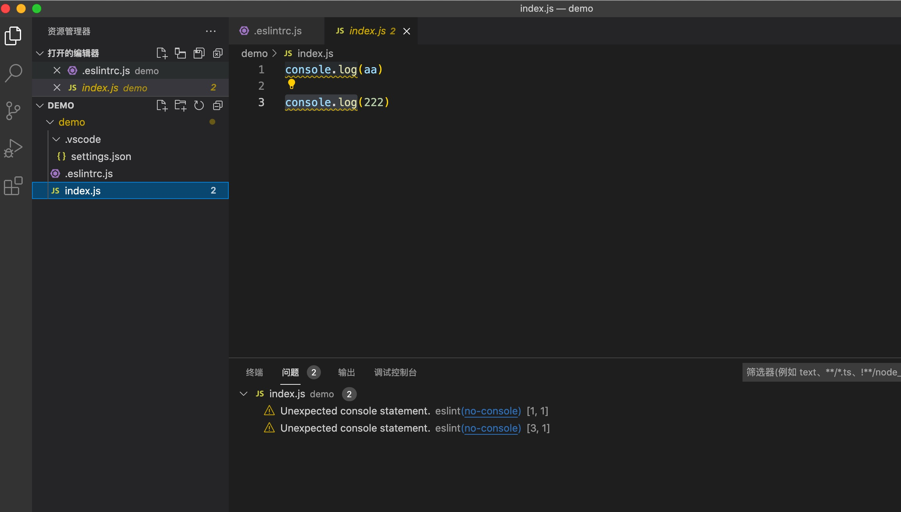

# vsocde 配置 ESLint

## 安装配置 ESlint 插件

1. 安装插件：打开 vscode 点击左边的应用商店，搜索 eslint 进行安装

2. 安装完成后重启项目，点击 “code” -> 首选项 -> 设置
> windows 下是 文件 > 首选项 > 设置

3. 在配置文件 settings.json 中添加如下 eslint 简单配置
> [配置项文档](https://github.com/microsoft/vscode-eslint/blob/f90802225e6180b12c51e742bed8f002d29a13d8/README.md) 

```js
 //配置eslint
  "eslint.run": "onType",
  "eslint.enable": true,
```
4. 或者点击左下角的设置安装选择 “设置” 进入 vscode 配置文件 settings.json

5. 可以在‘在线服务设置’中对 eslint 进行选配，配置完成后可以在 settings.json 中进行查看


6. 用户和工作区配置的区别
>用户配置属于对 vscode 的系统配置,工作区配置是对你左侧当前项目的配置，对工作区进行配置后会在你的项目中生成 .vscode 文件夹，里面的 settings 就是你的配置,用户配置的文件存在于全局下


## 在项目中使用 ESLint
1. 打开项目文件，通过 eslint --init 创建 .eslintrc.js
> 我本地是已经全局安装了 eslint ,如果没有安装 eslint 可以先安装在进行使用,

2. 在 .eslintrc.js 添加一下 eslint 语法规则
> [eslint规则文档](https://eslint.bootcss.com/docs/rules/)

3. 可以看到在 index.js 中已经出现了 eslint 的语法提示



## 常用 Eslint 配置
> 以下参数配置支持 vscode-eslint 中1.9.1 的版本,[2.2.2版本配置项文档](https://github.com/microsoft/vscode-eslint)
+ eslint.validate: 指定要强制验证的文件的语言标识符数组，2.2.2版本中已废弃，建议使用 probe，JavaScript 启用了自动探测。
+ eslint.enable：启用/禁用ESLint。默认情况下启用。
+ eslint.run：运行linter 的时间，onSave(保存后)或onType(输入时)，默认为onType
+ eslint.autoFixOnSave: 保存的时候将代码按eslint格式进行修复，2.2.2版本中已废弃，使用 codeActionsOnSave 替代。
+ eslint.debug：启用eslint的调试模式。
+ eslint.lintTask.enable：扩展是否为整个工作区文件夹提供lint任务。
+ eslint.quiet: 忽略警告
+ eslint.options: eslint使用配置文件
+ eslint.codeAction.disableRuleComment : 禁用规则注释

**注意：**
我本地使用的是vscode 1.40.0 和 vscode-eslint 1.9.1 在使用 vscode-eslint 的时候出现了报错
> 有参考 [这个问题](https://github.com/microsoft/vscode-eslint/issues/293) 添加 eslint.nodePath，无效后升级vscode 到最新版本，使用 vscode-eslint@2.2.2的版本，如果你也是这个问题建议升级 vscode 和 vscode-eslint
```bash
typeerror:t.library.cliengine is not a constructor. xxx
```
