# Github 仓库的使用

## 创建、使用 GitHub 仓库
1. 登录 Github 账号，点击头像选择 ‘Your profile’
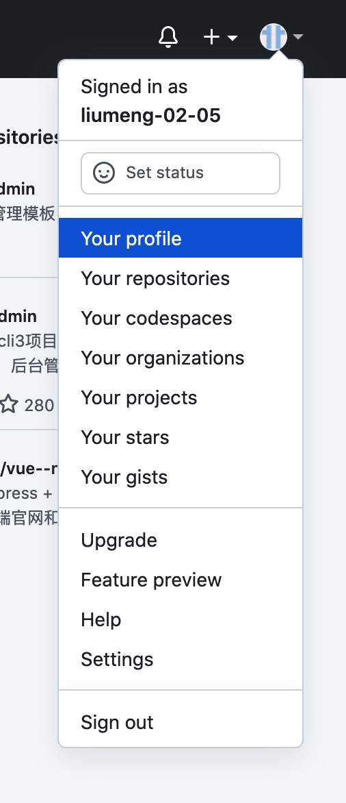
2. 进入之后就可以看到你的仓库，点击 ‘New’ 创建新仓库
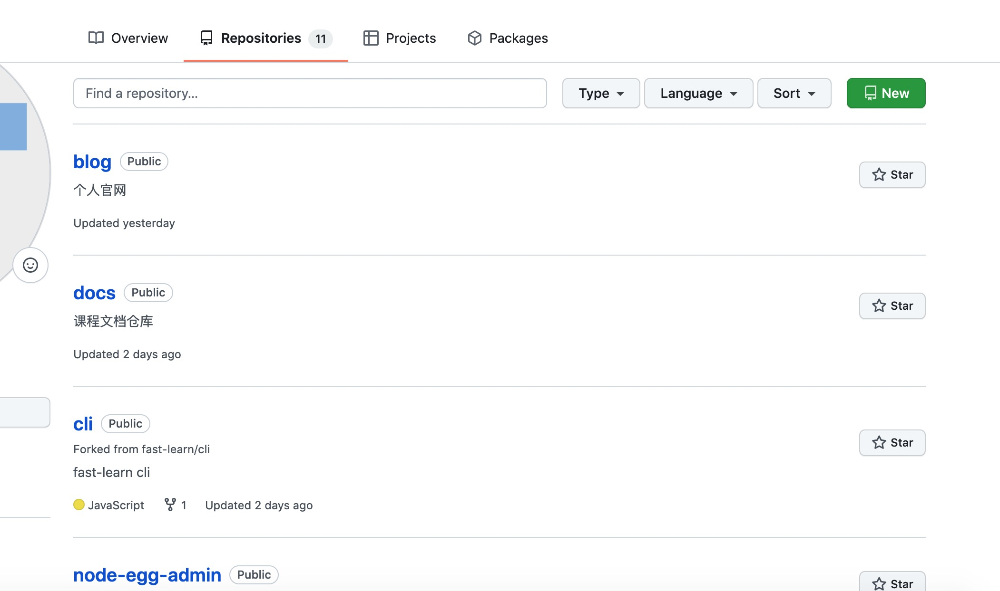
3. 输入仓库名称、描述信息，选择仓库类型为 ‘Public’, 点击 ‘Create repository’
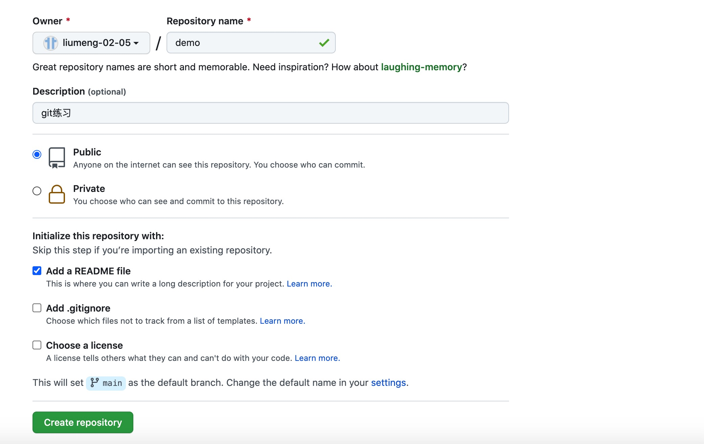
4. 点击之后就可以看到仓库了，点击 ‘Code’ 把 SSH 的链接复制一下
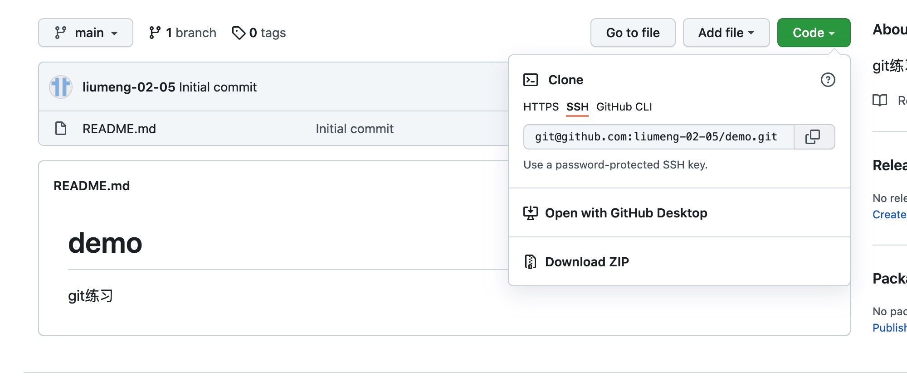
5. 在本地创建文件，通过 ’ git clone 仓库的 SSH 链接 ‘ 克隆仓库代码到本地，
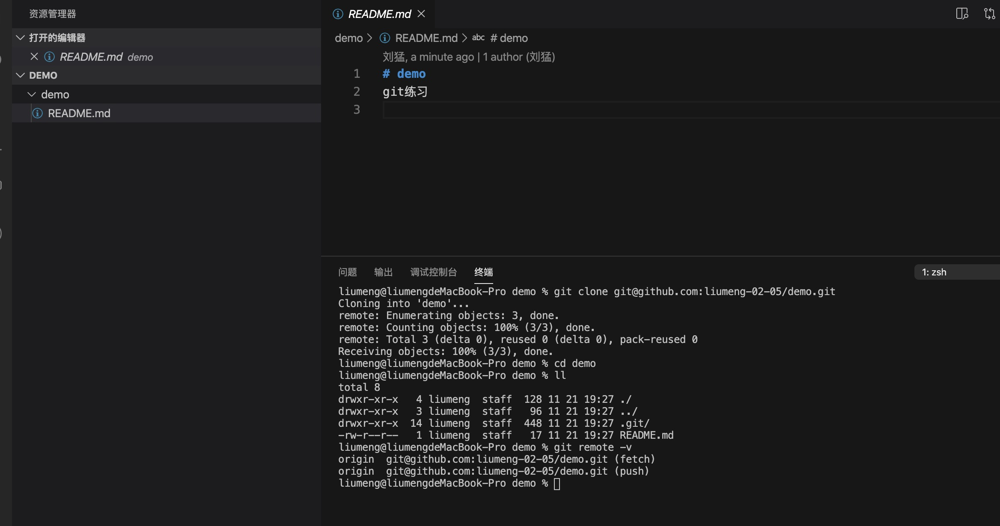
6. 在本地添加代码，提交到缓存区，可以通过 git status 查看提交的文件状态
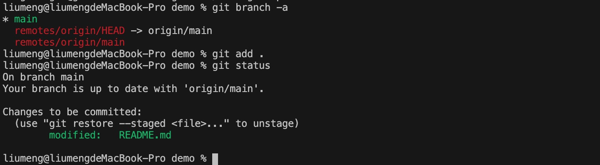
7. 如果想撤回提交的文件，可以通过 git reset xx 撤回指定文件，或者 git reset 撤回所有文件
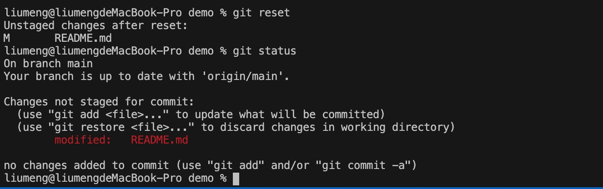
8. 本地代码修改完成后就可以提交代码推送到远程仓库了
```bash
git commit -m '提交代码的描述性信息'
git push origin main
```
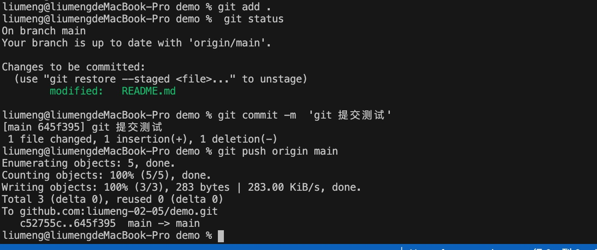
9. 进入 Github 仓库就可以看到提交的内容了
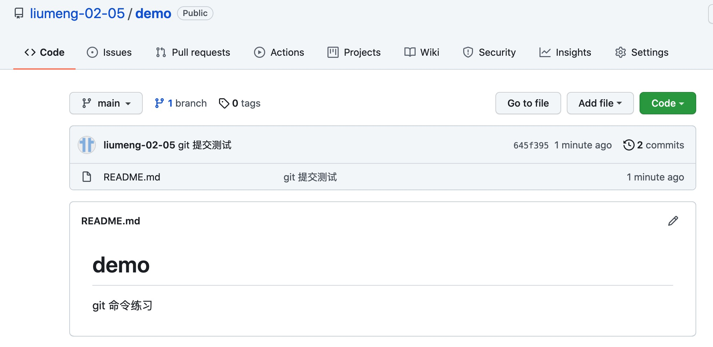


## 本地项目链接远程仓库
> 有时会遇到远程仓库还没有创建，需要我们先在本地进行开发的情况，可以先在本地编写代码，等到仓库创建完成后，在和远程仓库创建链接，提交代码。
1. 复制仓库的 SSH 地址，进入项目在本地进行 git 初始化操作
```bash
git init
git remote add origin 仓库的 SSH 地址
```
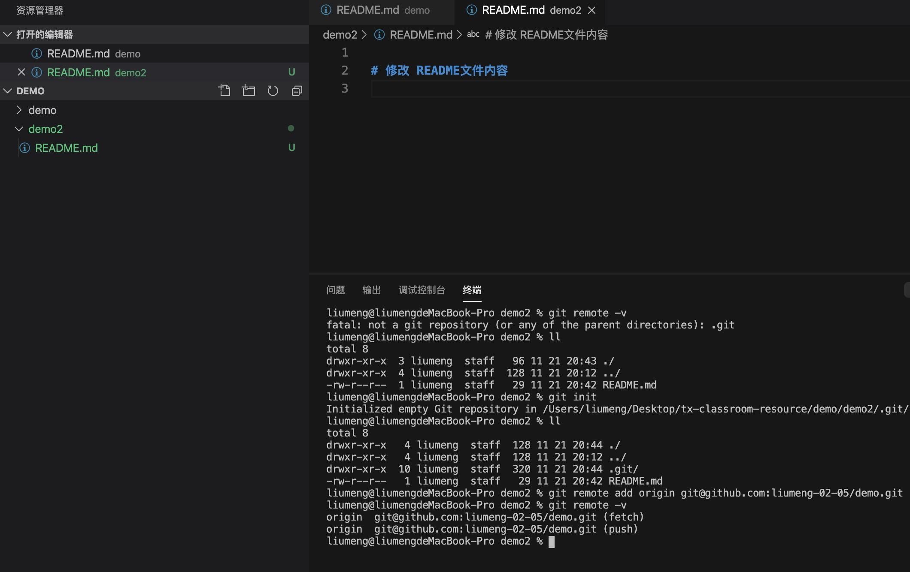
2.完成 git 初始提交
> 直接在本地创建分支的时候会报错 'fatal: Not a valid object name: 'master'.' 这是因为刚创建的git仓库默认的master分支要在第一次commit之后才会真正建立，否则就像你声明了个对象但没初始化一样。
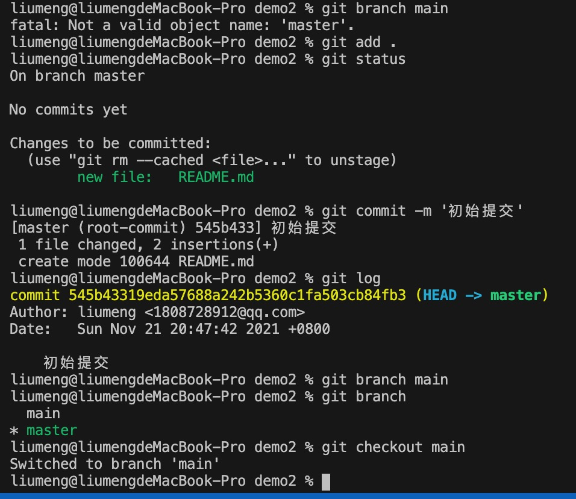
3. 创建并切换分支
```bash
// 直接创建切换
git checkout -b mian
// 或者先创建分支在切换分支
git branch main
git checkout main
```
4. 同步远程仓库代码
> 直接拉去远程仓库的代码会报错 ‘fatal: refusing to merge unrelated histories’，这是因为两个分支是两个不同的版本，具有不同的提交历史，可以通过 --allow-unrelated-histories 选项来解决问题，该选项可以合并两个独立启动仓库的历史
```bash
git pull origin main --allow-unrelated-histories
```
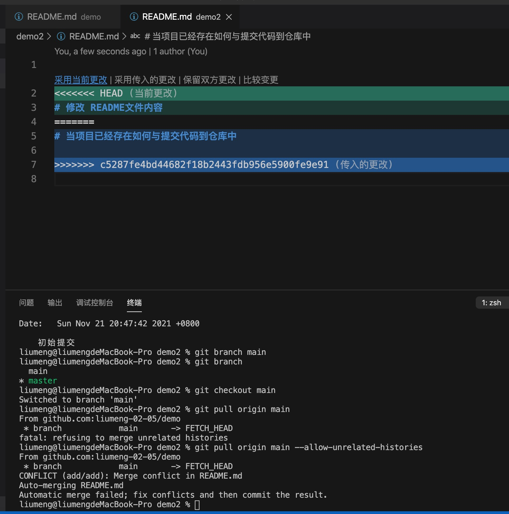
5. 修改本地项目和远程仓库中的冲突代码
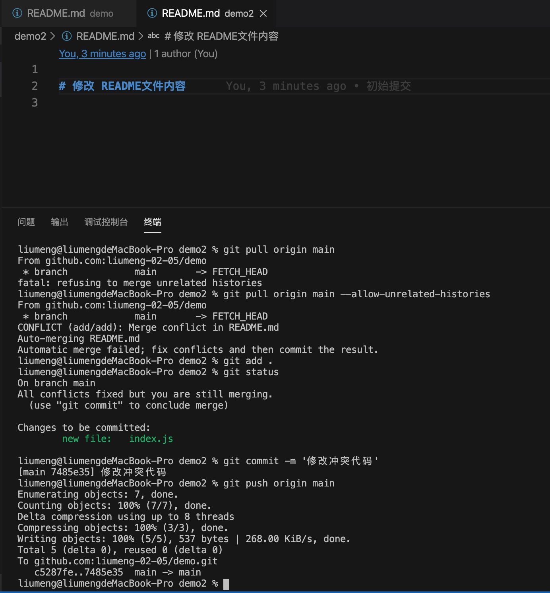
6. 提交代码完成后就可以在仓库中看到自己提交的内容了
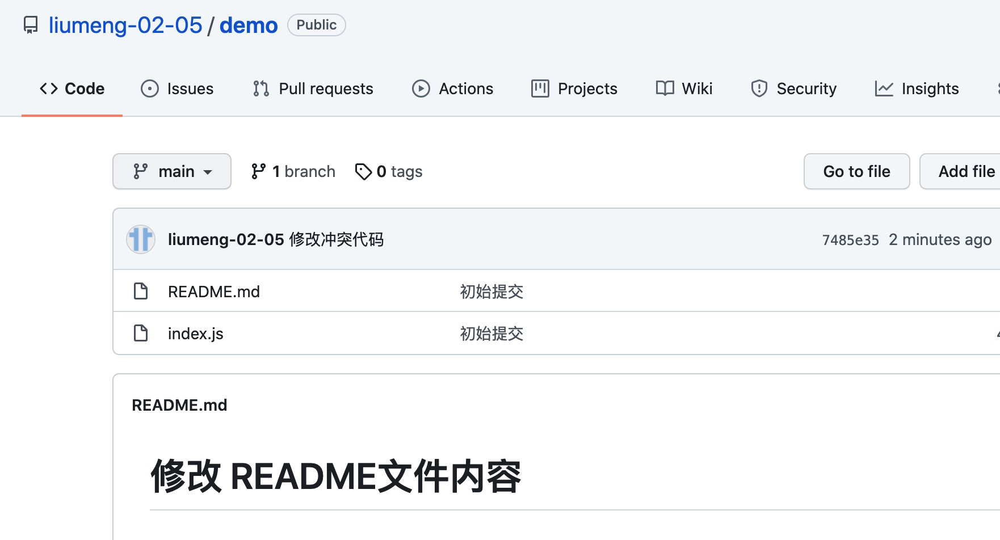