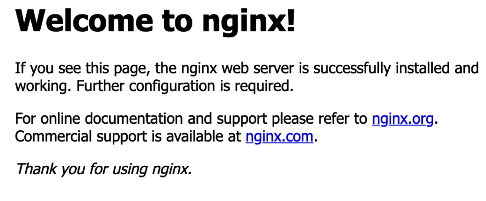
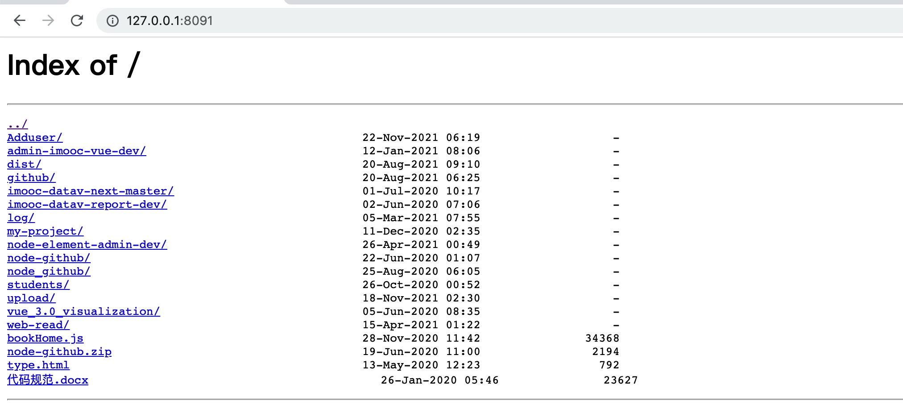
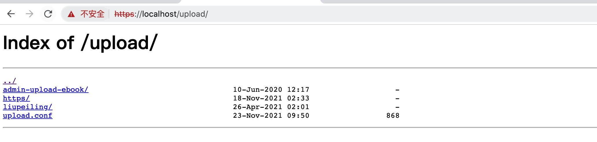

# 搭建 nginx 服务器

# 安装
> windows 可以通过官网下载 nginx 安装包，[下载地址](http://nginx.org/en/download.html)
1. 安装 Homebrew
> 大概二十分钟左右就可以安装完成了,其间要根据提示输入密码,安装成功后就可以安装nginx了. 安装完成后可以通过 which brew 检查是否安装完成
```bash
ruby -e "$(curl -fsSL https://raw.githubusercontent.com/Homebrew/install/master/install)"
```
2. 安装 nginx
> 安装完成后，可以通过 nginx -v 检查 nginx 的版本
```bash
brew install nginx
```
3. 启动 nginx 服务
> nginx 默认端口是 80 直接在地址栏输入，http://127.0.0.1 就可以看到欢迎界面
```bash
nginx 或者 sudo nginx
```


# 配置本地 nginx 文件
1. 打开配置文件 nginx.cof
> Mac OS 位于 /usr/local/etc/nginx/nginx.conf
```bash
liumeng@liumengdeMacBook-Pro bin % cd /usr/local/etc/nginx
liumeng@liumengdeMacBook-Pro nginx % ll
total 136
drwxr-xr-x  18 liumeng  admin   576  7 28 08:42 ./
drwxrwxr-x   8 liumeng  admin   256 10 10  2020 ../
-rw-r--r--   1 liumeng  admin  1077  3 12  2020 fastcgi.conf
-rw-r--r--   1 liumeng  admin  1077  3 12  2020 fastcgi.conf.default
-rw-r--r--   1 liumeng  admin  1007  3 12  2020 fastcgi_params
-rw-r--r--   1 liumeng  admin  1007  3 12  2020 fastcgi_params.default
-rw-r--r--   1 liumeng  admin  2837  3 12  2020 koi-utf
-rw-r--r--   1 liumeng  admin  2223  3 12  2020 koi-win
-rw-r--r--   1 liumeng  admin  5231  3 12  2020 mime.types
-rw-r--r--   1 liumeng  admin  5231  3 12  2020 mime.types.default
-rw-r--r--   1 liumeng  admin     0  7 28 08:42 nginx.con
-rw-r--r--   1 liumeng  admin  2752  1 12  2021 nginx.conf
-rw-r--r--   1 liumeng  admin  2680  3 12  2020 nginx.conf.default
-rw-r--r--   1 liumeng  admin   636  3 12  2020 scgi_params
-rw-r--r--   1 liumeng  admin   636  3 12  2020 scgi_params.default
-rw-r--r--   1 liumeng  admin   664  3 12  2020 uwsgi_params
-rw-r--r--   1 liumeng  admin   664  3 12  2020 uwsgi_params.default
-rw-r--r--   1 liumeng  admin  3610  3 12  2020 win-utf
liumeng@liumengdeMacBook-Pro nginx %
```
2. 打开配置文件 nginx.conf 添加当前登录用户为owner
```bash
user liumeng owner;
```
3. 添加本地配置文件
> 这个文件你可以在任意地方创建，在 nginx.conf 中要使用 include 指向配置文件
```bash
include /Users/liumeng/Desktop/fubaoyouyou/upload/upload.conf;
```
4. 打开本地配置文件，添加 http 配置
> charset：页面编码，listen：监听端口，server_name：监听地址，root：根目录，autoindex：自动创建索引（是否显示目录），add_header Cache-Control：缓存设置，location：匹配URL，add_header Access-Control-Allow-Origin：允许访问的源
```bash
server
{
  charset utf-8;
  listen 8091;
  server_name https_host;
  root /Users/liumeng/Desktop/fubaoyouyou/;
  autoindex on;
  add_header Cache-Control "no-cache, must-revalidate";
  location / {
    add_header Access-Control-Allow-Origin *;
  }
}
```
5. 配置完成后，退出编辑模式，保存文件, 检测 nginx 配置语法，如果没有问题，重启 nginx 服务
```bash
liumeng@liumengdeMacBook-Pro nginx % sudo nginx -t
nginx: the configuration file /usr/local/etc/nginx/nginx.conf syntax is ok
nginx: configuration file /usr/local/etc/nginx/nginx.conf test is successful
liumeng@liumengdeMacBook-Pro nginx % sudo nginx -s reload
liumeng@liumengdeMacBook-Pro nginx %
```
6. nginx 服务重启后在地址栏中输入 http://127.0.0.1:8091, 就可以访问了


## 配置 https 服务
> 配置 nginx 的 https 服务，需要证书的支持。
1. 打开本地创建的配置文件 upload.conf
2. 添加 https 配置
> ssl_certificate: 证书中的 .pem文件，ssl_certificate_key：证书中的.key文件，ssl_session_timeout：指定客户端可以重用会话参数的时间, ssl_protocols: 使用TLS 协议，ssl_ciphers：密码套件，ssl_prefer_server_ciphers：是否由服务器决定采用哪种加密算法
```bash
server
{
  listen 443 default ssl;
  server_name https_host;
  root /Users/liumeng/Desktop/fubaoyouyou/;
  autoindex on;
  add_header Cache-Control "no-cache, must-revalidate";
  location / {
  add_header Access-Control-Allow-Origin *;
  }
  ssl_certificate /Users/liumeng/Desktop/fubaoyouyou/upload/liupeiling/5530542_www.liumeng.xin.pem;
  ssl_certificate_key /Users/liumeng/Desktop/fubaoyouyou/upload/liupeiling/5530542_www.liumeng.xin.key;
  ssl_session_timeout 5m;
  ssl_protocols SSLv3 TLSv1.2;
  ssl_ciphers ALL:!ADH:!EXPORT56:RC4+RSA:+HIGH:+MEDIUM:+LOW:+SSLv2:+EXP;
  ssl_prefer_server_ciphers on;
}
```
* 注意：如果ssl_protocols配置的是TLSv1,https协议版本过低会导致在访问时提示网站不安全
3. 配置完成后，检查配置文件的语法，没有问题就可以重启 nginx 服务了
4. https 服务默认 443 端口，直接在地址栏输入 https://127.0.0.1 就可以进行访问

5. 进阶内容：打开 upload.conf,在 ‘location / {}' 前，配置根目录重定向
> =/ 精确匹配如果是根目录就重定向到指定的目录（https://localhost/upload）
```bash
...
location =/ {
  rewrite ^(.*)$ https://localhost/upload;
}
...
```

