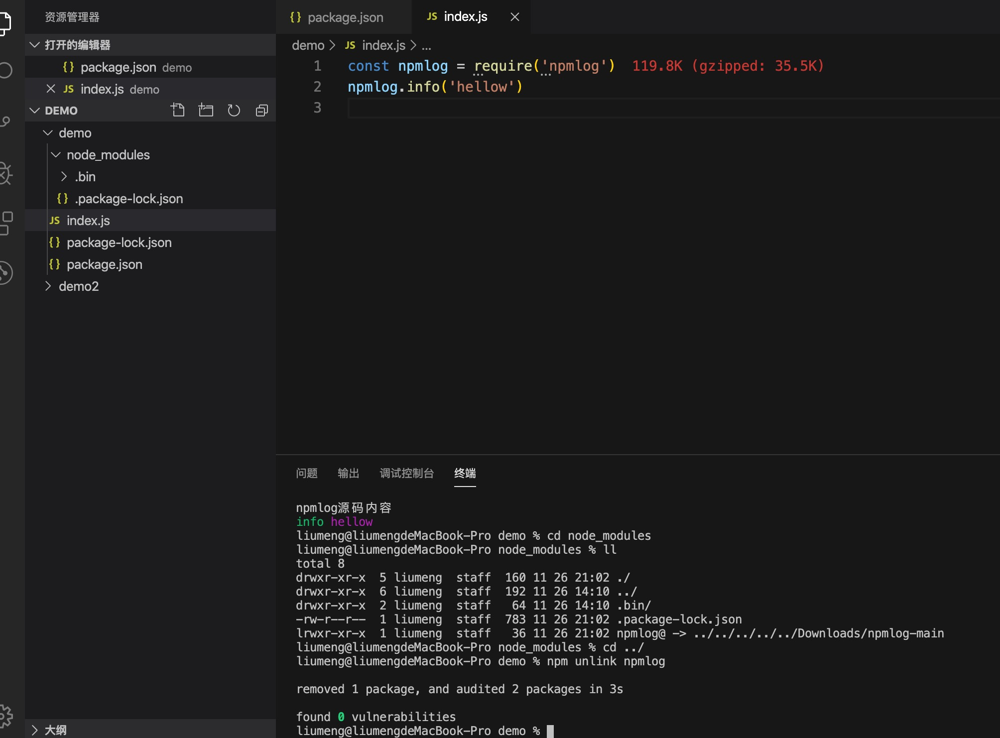

# npm link 链接测试模块

## 功能
在本地开发npm模块的时候，我们可以使用npm link命令，将npm 模块链接到对应的运行项目中去，方便地对模块进行调试和测试

## 创建链接
1. 进入需要链接的项目文件，执行 npm link
> 我在本地下载了 npmlog 的源码进行演示，本地有两个项目文件，npmlog 项目源码和 演示用的 demo 项目

2. 命令执行后，npmlog 会根据package.json上 name 的配置，将模块链接到全局，这里的命名是可以自己定义的，可以看到这里没有显示链接的地址，我使用的是 node v14.15.0的版本,我们换一个低的版本 node v12.11.1 试一下
> 我本地安装了 nvm 管理 node 的版本所以这里的地址会是全局下的 .nvm/xx，如果你本地没有安装 nvm 链接的地址是全局的 node 文件下

3. 可以看到使用 12.x 的版本是可以看到 npmlog 链接到全局的地址，我们在进入 全局下 v14.15.0 的版本中找一下链接的 npmlog

4. 可以看到 npmlog 已经被添加到全局了，查看一下文件属性，这里的 npmlog 是一个软连接，指向我们本地 npmlog 的文件地址

5. 根据 package.json 中的 main 字段，可以看到 npmlog 的入口文件是 'lib/log.js', 在这里打印一下内容

## 项目实践
1. 进入 demo 的项目, 在 package.json 中添加 npmlog 的依赖，执行 npm link npmlog 引入链接的模块
> 我们链接的是本地的 npmlog 所以这里的版本号可以随便写

2. 在文件中使用 npmlog， 可以看到 npmlog 已经可以正常使用了，而且也打印了源码中的内容， node_modules 中 npmlog 源文件也是一个软连接，指向我们本地下载的 npmlog 源码位置

3. 项目测试完毕后，可以通过 npm unlink npmlog 删除软连接, node_modules 中也会删除对应的链接文件
> 使用 npm link 链接的模块是不能通过 npm install 安装的，npm install 安装的是 npm 网站里的模块，没有发布上去会报错找不到模块。

