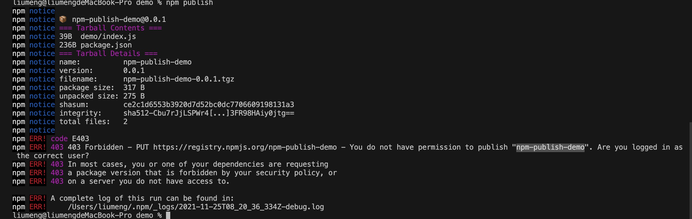

# npm 发包

## 注册账号
1. 进入 npm 官网
> [npm 官网地址](https://www.npmjs.com/)

2. 如果没有 npm 账号可以点击左上角的 ‘Sign Up’注册账号,输入用户名、密码、邮箱，勾选同意用户许可证和协议，点击‘Create an Account’ 创建账号

3. 创建账号后，npm 会向你填写的邮箱中发送邮件，需要你进入邮箱进行验证，否则后面发包的时候会提示邮箱验证失败
> 如果邮箱没有收到信息或者更换邮箱地址，可以登录 npm 账号，点击头像，选择 ‘Account’ 更改邮箱重新验证。


## 发布组件
1. 在本地新建一个文件，执行 init 初始化命令添加 package.json 文件
```bash
// 直接创建一个模版文件然后进入package.json中进行添加
npm init -y
// 或者在命令执行时添加项目信息
npm init
```

2. 添加入口文件

3. 在终端执行 npm login 命令，输入用户名、密码和邮箱
> 注意检查一下显示的登录地址，如果是私有源或者公司内部的源也会导致发包失败


4. 登录完成后就可以执行 npm publish 发布命令

5. 发布之后可以看到有个 403 错误，提示没有权限，这是因为包名重名了。可以在发布前 npm 上搜索一下包名是否被使用

6. 可以看到 npm 上这个包名已经被使用了，我们可以换一个 npm 上没有使用的包名,再次执行 npm publish 命令

7. 发布成功之后可以在 npm 上搜索一下自己发布的包

8. 如果想要删除自己发布的包可以使用 npm unPublish 包名 --force
> 也可以删除包的指定版本 npm unPublish 包名@版本号 --force


9. 删除之后可以在 npm 上检查一下，这时包已经被删除了


**注意：**
npm发布公告称2021年10月4日后，npm 网站和 npm registry 必须使用 TLS 安全套接层 1.2 版本，所以需要升级对应版本,建议升级最新版node和npm,修改npm的源为
```bash
npm config set registry https://registry.npmjs.org
```