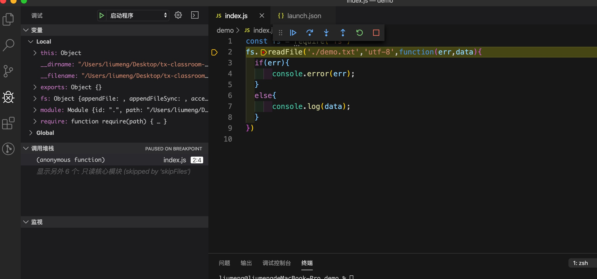

# vscode 断点测试

## vscode 设置中文

1. 下载插件：进入 vscode 官网，根据自己的系统选择下载
> [vscode 下载地址:](https://code.visualstudio.com/)

2. 安装完成后打开 vsocde 按住 “command + ⬆️ +  P” 搜索 “configure language ”
> windows 环境下是 ”ctrl + shift + p “ 搜素 “configure language”

3. 选择显示语言为 “zh-cn”

4. 点击弹框中的 “重启” 按钮，语言就配置完成了

## vscode 断点测试
1. 进入项目，在需要源码左侧单击创建断点,点击左侧的 ‘调试’ 按钮

2. 点击左上方的 ‘设置’ 按钮， 选择调试环境

3. launch.json 就是调试文件，可以选择刚才的配置，也可以点击 ‘添加配置’ 选择其他调试方式

4. 配置添加之后，可以点击左上角的绿色小三角进行调试了

5. 调试按钮

+ 按钮1：运行/继续 F5，真正的一步一步运行
+ 按钮2：单步跳过(又叫逐过程) F10，按语句单步执行。当有函数时，不会进入函数。
+ 按钮3：单步调试（又叫逐语句） F11：当有函数时，点击这个按钮，会进入这个函数内。
+ 按钮4：单步跳出 ⇧F11:如果有循环，点击该按钮，会执行到循环外面的语句。
+ 按钮5：重启 ⇧⌘F5：
+ 按钮6：停止 ⇧F5：

## launch.json常使用的变量

+  workspaceRoot：VS Code当前打开的文件夹
+  skipFiles： 想要忽略的文件
+  file ：当前打开的文件
+  relativeFile：相对于workspaceRoot的相对路径
+  fileBasenameNoExtension：当前文件的文件名，不带后缀，也即launch
+  fileBasename： 当前打开文件的文件名
+  fileDirname： 所在的文件夹，是绝对路径
+  fileDirname：文件所在的文件夹路径
+  lineNumber：当前文件光标所在的行号
+  fileExtname：当前打开文件的拓展名，如.json
+  cwd： 启动时任务运行程序的当前工作目录
+  workspaceFolder：表示当前workspace文件夹路径
+  workspaceRootFolderName：表示workspace的文件夹名
+  env:PATH：系统中的环境变量

## 配置项说明如下

request：请求配置类型，可以为launch（启动）或attach（附加）
下面是launch 和 attach 类型共有的属性：

+ protocol：设置调试协议
+ auto： 尝试自动检测目标运行时使用的协议
+ inspector 新的V8调试器协议，解决遗留版本的多数问题，node versions >= 6.3 and Electron versions >= 1.7.4
+ legacy： 原始的v8调试器协议，node versions < v8.0 and Electron versions < 1.7.4.
+ port：调试使用的端口
+ address ：TCP/IP地址，用于远程调试
+ localRoot： 远程调试时映射的本地地址
+ remoteRoot： 远程调试时的远程目录地址
+ sourceMaps： 默认为true
+ outFiles ：当map文件不在js文件同目录时用于指定 sourceMaps的位置
+ restart ：自动重启调试
+ timeout： 配置自动附加的超时时间
+ stopOnEntry： 自动断点到第一行代码处
+ smartStep： 自动跳过未映射到源代码的代码
+ skipFiles :[]String,指定跳过单步调试的代码
+ trace ： 启用诊断输出

以下是特定于类型 launch(启动)的配置属性：

+ program： 指定调试入口文件地址
+ args ： []String 传递给程序的参数,可在process.argv拿到
+ cwd ：指定程序启动调试的目录 ,当vscode启动目录不是项目根目录，并且调试npm script时非常有用
+ runtimeExecutable： 设置运行时可执行文件路径，默认是node
可以是其他的执行程序，如npm、nodemon
+ runtimeArgs： 传递给运行时可执行文件的参数,例如：
+ runtimeVersion： 设置运行时可执行程序的版本，如果使用nvm，可以切换node.js版本
+ env： 添加额外的环境变量
+ envFile： 文件加载环境变量
+ console： 配置终端可以是外部终端或者内部集成终端，默认值internalConsole
+ autoAttachChildProcesses： 跟踪调试对象的所有子过程，并自动附加到在调试模式下启动的子过程