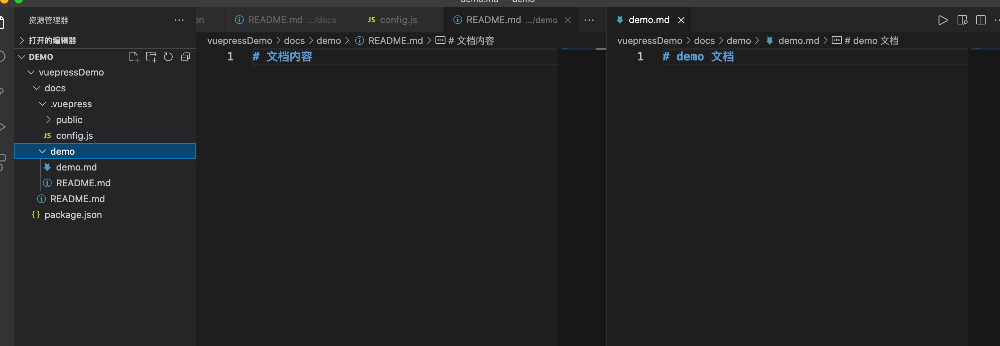

# Vuepress 搭建个人博客、文档

## 介绍
> VuePress 是尤雨溪发布的一个全新的基于 vue 的静态网站生成器,它由两部分组成：一个以 Vue 驱动的主题系统的简约静态网站生成工具，和一个为编写技术文档而优化的默认主题。它是为了支持 Vue 子项目的文档需求而创建的。由 VuePress 生成的每个页面，都具有相应的预渲染静态 HTML，它们能提供出色的加载性能，并且对 SEO 友好。然而，页面加载之后，Vue 就会将这些静态内容，接管为完整的单页面应用程序(SPA)。当用户在浏览站点时，可以按需加载其他页面。[vuepress 官网地址](https://v2.vuepress.vuejs.org/zh/)

## 初始化项目
1. 全局安装 vuepress
```bash
npm install vuepress -g
```
2. 创建项目，执行初始化命令
```bash
mkdir vuepressDemo
cd vuepressDemo
npm init -y
```
3. 创建项目文件

```
vuepressDemo
├── docs
|   ├── README.md
│   └── .vuepress
│       ├── public
│       └── config.js
└── package.json
```
4. 在 config.js 中配置文档的标题、描述、主题等相关信息
> 启动的 port 和 host 都可以在这里进行选配。[vuepress 配置文档](https://v2.vuepress.vuejs.org/zh/reference/frontmatter.html#title)
```bash
module.exports = {
  title: "Vuepress Blog", // 标题
  description: 'vuepress 的演示文档', // 文档的我描述性说明
  themeConfig: {
    nav: [
      // 导航栏配置
      { text: "首页", link: "/" },
    ],
    sidebar: "auto", // 侧边栏配置
    sidebarDepth: 2, // 侧边栏显示2级
  },
};
```
5. 添加启动命令：在 package.json 的 scripts 属性中添加启动项目的命令
```json
"scripts": {
    "dev": "vuepress dev docs",
    "build": "vuepress build docs"
},
```
6. 在首页中输入一些内容
> vuepress 中使用的是 markdown 的语法, [markdown 语法文档](http://markdown.p2hp.com/basic-syntax/)

6. 启动项目就可以查看到项目效果
> 默认启动的是 8080 端口，我本地有项目已经占用了 8080 端口，会默认向后启动 8081 端口
```bash
npm run dev
```


## 设置封面、添加新页面
1. 在 docs/README.md 修改封面代码
> actionLink是和 config 中配置的路由地址。[封面属性文档](https://v2.vuepress.vuejs.org/zh/reference/default-theme/frontmatter.html#%E9%A6%96%E9%A1%B5)
```bash
---
home: true
heroText: 个人博客
tagline:  xx 的博客
actionText: 进入文档 →
actionLink: /demo/
---

# 欢迎大家进入 xx 的博客

## 封面介绍
```

2. 创建新页面文件 demo
> 这里添加两个文件，demo/README.md 是演示导航默认使用的文件，demo/demo是添加到侧边栏的文件

3. 在 config.js 中增加新导航 demo 配置，修改 sidebar属性 添加路由文件
```bash
nav: [
  // 导航栏配置
  { text: "首页", link: "/" },
	{ text: "演示", link: "/demo/" },
],
sidebar: {
      collapsable: false,
      '/demo/': [
        {
          title: '文档',
          collapsable: false,
          children: [
            ''
          ]
        }
      ]
    }
```

4. 添加侧边栏内容
```bash
sidebar: {
	collapsable: false,
	'/demo/': [
		{
			title: '文档',
			collapsable: false,
			children: [
				''
			]
		},
		{
			title: 'DEMO',
			collapsable: false,
			children: [
				'/demo/demo'
			]
		}
	]
}
```

