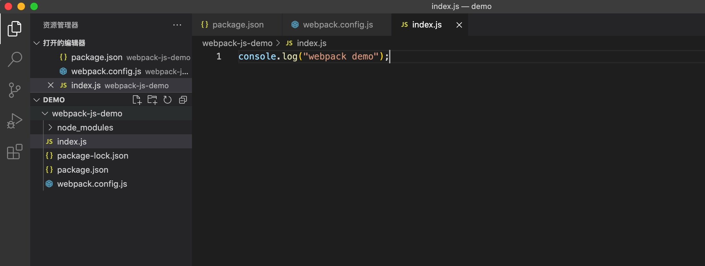
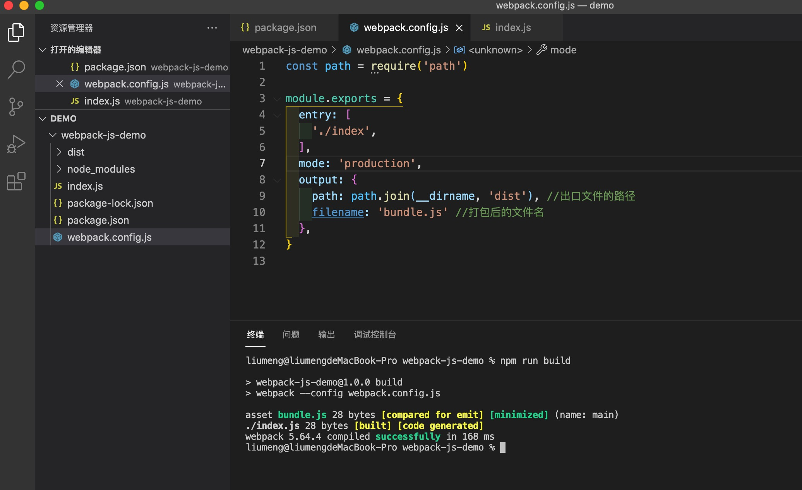
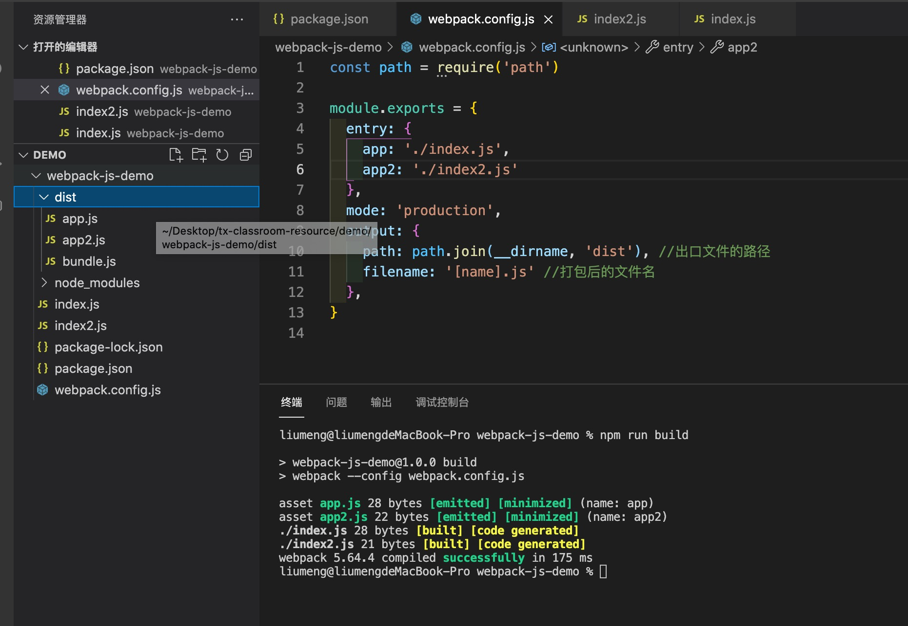
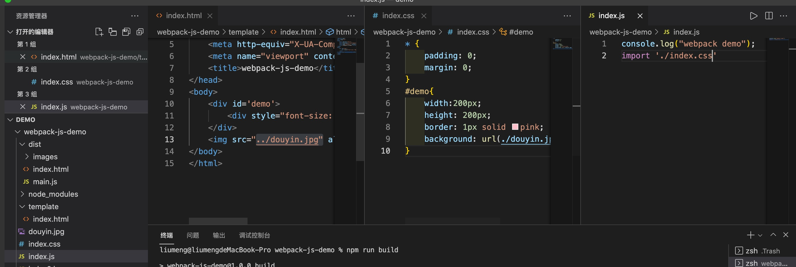
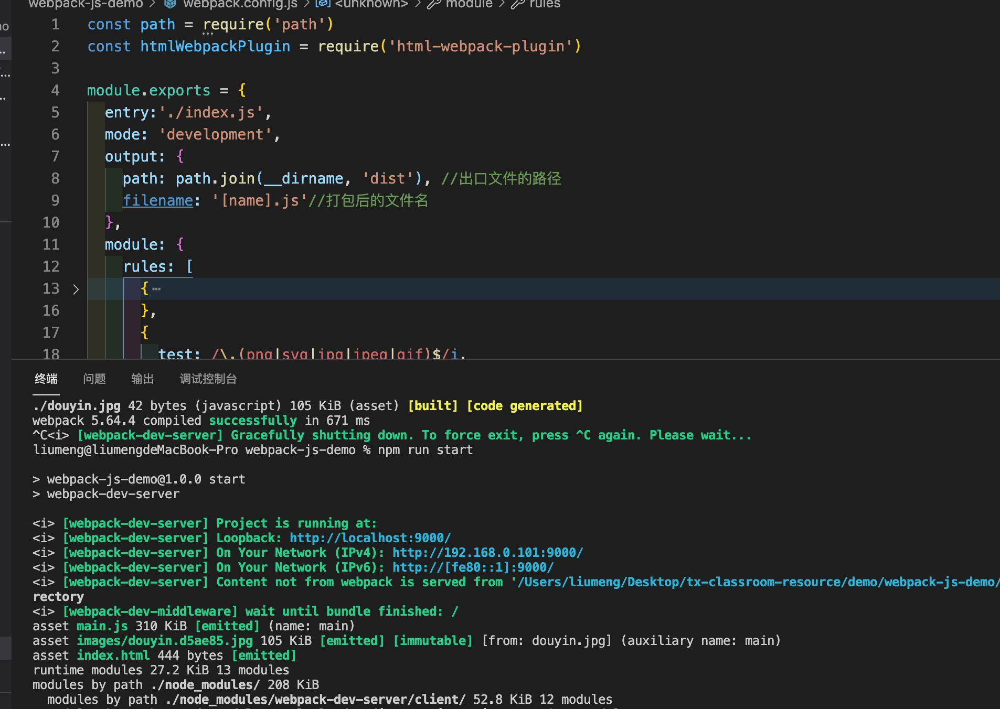
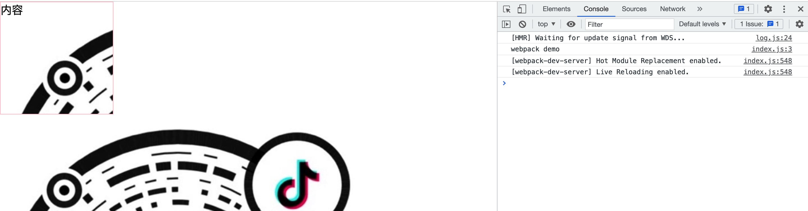
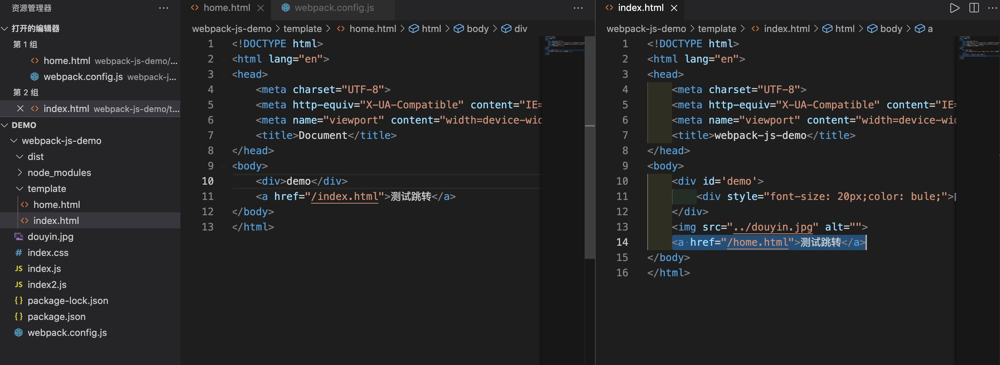

# webpack 搭建原生项目

## webpack 介绍

> webpack 是代码编译工具，有入口、出口、loader 和插件。webpack 是一个用于现代 JavaScript 应用程序的静态模块打包工具。当 webpack 处理应用程序时，它会在内部构建一个依赖图(dependency graph)，此依赖图对应映射到项目所需的每个模块，并生成一个或多个 bundle. [webpack 官网地址](https://webpack.docschina.org/concepts/)

## 项目初始化

1. 新建项目文件，执行项目初始化

```bash
mkdir webpack-js-demo
cd webpack-js-demo
npm init -y
```

2. 安装 webpack 插件

```bash
npm install webpack webpack-cli -D
```

3. 创建入口文件 index.js 和配置文件 webpack.config.js
   
4. 在配置文件 webpack.config.js 中添加模式、入口文件相关配置
   > development: 开发模式，production:打包模式，如果没有设置，webpack 会给 mode 的默认值设置为 production。详细内容可以翻看
   > [webpack 文档](https://webpack.docschina.org/configuration/mode/)

```js
const path = require("path");

module.exports = {
  entry: "./index",
  mode: "production",
  output: {
    path: path.join(__dirname, "dist"), //出口文件的路径
    filename: "bundle.js", //打包后的文件名
  },
};
```

5. 在 package.json 中添加启动命令

```json
"scripts": {
    "build": "webpack --config webpack.config.js"
},
```

6. 执行打包命令，打包测试文件
   
7. 多入口文件配置

```js
const path = require("path");

module.exports = {
  entry: {
    app: "./index.js",
    app2: "./index2.js",
  },
  mode: "production",
  output: {
    path: path.join(__dirname, "dist"), //出口文件的路径
    filename: "[name].js", //打包后的文件名
  },
};
```



## 配置项目模版、样式处理、webpack-dev-server 服务器

1. 安装项目模版 html-webpack-plugin

```bash
npm install html-webpack-plugin -S
```

2. 创建 template/index 模版文件，在 webpack.config.js 中添加配置

```js
const htmlWebpackPlugin = require("html-webpack-plugin");

plugins: [
  new htmlWebpackPlugin({
    filename: "index.html",
    template: "./template/index.html",
  }),
];
```
3. 在模版文件中添加样式内容，
   
4. 引入样式插件

```bash
npm install style-loader css-loader -S
```

5. 在 webpack.config.js 中配置规则

```js
module: {
  rules: [
    {
      test: /\.css$/,
      use: ['style-loader', 'css-loader'],
    },
  ],
},

```
5. 引入图片配置
> webpack5 中 资源模块(asset module)是一种模块类型，它允许使用资源文件（字体，图标等）而无需配置额外 loader。html-loader默认是以esModule的方式进行编译，需要修改一下html-loader的options配置，将esModule改为false [资源模块](https://webpack.docschina.org/guides/asset-modules/)
```bash
npm install html-loader -S
```
```js
{
  test: /\.(png|svg|jpg|jpeg|gif)$/i,
  type: 'asset',
  parser: {
    dataUrlCondition: {
      maxSize: 8 * 1024,
    },
  },
  generator: {
    filename: 'images/[name].[hash:6][ext]',
  },
}
{
   test: /\.html$/i,
   loader: "html-loader",
   options:{
      esModule:false,
   }
},
```
6. 安装 webpack-dev-server
```bash
npm install webpack-dev-server -S
```
7. 在 webpack.config.js 中添加 webpack-dev-server 配置
```js
devServer: {
  static: {
    directory: path.join(__dirname, 'dist'),
  },
  compress: true,
  port: 9000,
  hot: true,
},
```
8. 在 package.json 中添加启动命令，启动项目,就可以在端口访问项目了
```json
"start": "webpack-dev-server"
```


9. 清除上一次打包文件 clean-webpack-plugin
```bash
npm install clean-webpack-plugin -S 
```
```js
const { CleanWebpackPlugin } = require('clean-webpack-plugin')

plugins: [
	new CleanWebpackPlugin()
]
```
10. 多页面配置
```js
plugins:[
   new htmlWebpackPlugin({
      filename: 'index.html',
      template: './template/index.html'
   }),
   new htmlWebpackPlugin({
      filename: 'home.html',
      template: './template/home.html'
   }),
}
```


