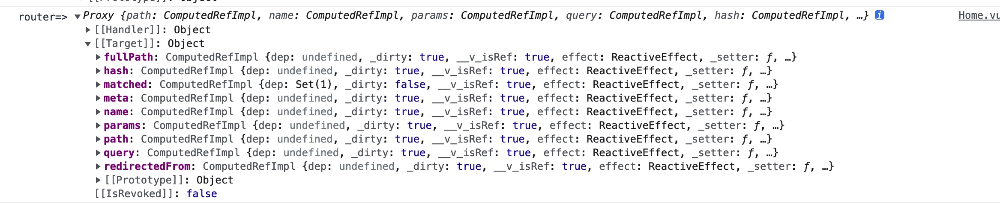

# webpack 搭建 vue 项目

## 初始化项目
1. 创建项目，执行初始化命令
```bash
mkdir webpack-vue-demo
cd webpack-vue-demo
npm init -y 
```
2. 安装 webpack 插件，创建入口文件 src/main.js 和配置文件 webpack.config.js
```bash
npm install webpack@5.50.0 webpack-cli -D
```
3. 在 webpack.config.js 中添加入口文件和mode等初始配置
```bash
const path = require('path');

module.exports = {
  entry: './src/main.js',
  mode: 'production',
  output: {
    path: path.join(__dirname, 'dist'), //出口文件的路径
    filename: 'builde.js' //打包后的文件名
  },
};
```
4. 创建 vue 文件和样式文件,并在 main.js 中引入 vue 文件


```vue
// app.vue 
import { ref } from 'vue'
export default {
	setup(){
		const message = ref('hellow vue')
		return {
			message
		}
	}

}
```
``` js
// main.js
import { createApp } from 'vue';
import App from  './app.vue'
import './style/index.scss'
createApp(App).mount('#app');

```
5. 在项目中安装 vue @vue/compiler-sfc @vue/cli-service
> 注意直接通过 npm install vue 安装的是 2.6.14的版本，可以在安装时通过 vue@xx 指定版本号，或者在 package.json 中手动添加版本号后在安装依赖. @vue/compiler-sfc:主要是用来解析SFC组件,一个SFC（*.vue）文件三大要素是template、script、style，vue-compiler-sfc就是负责解析这三大要素,@vue/cli-service 其内部使用的 html-webpack-plugin 版本是3.2.0 和webpack5 存在兼容性问题，这个问题在 @vue/cli-service@5.0.0-beta 版本中进行了修复 因为没有正式发布，所以暂时只能使用测试版本 [更新文档：](https://github.com/vuejs/vue-cli/blob/dev/CHANGELOG.md)
```bash
npm install vue@3.2.23  -D
npm install @vue/compiler-sfc @vue/cli-service@5.0.0-beta.2 -S
```
6. 引入 vue编译插件 vue-loader,并添加配置
```bash
npm install vue-loader-v16 -S
```
```js
// webpack.config.js
const { VueLoaderPlugin } = require("vue-loader");

module: {
  rules: [
    {
      test: /\.vue$/,
      loader: "vue-loader"
    },
  ]
}

plugins:[
  new VueLoaderPlugin()
]
```
7. 引入样式处理文件并在 webpack.config.js 中进行配置
```bash
npm install style-loader css-loader node-sass sass-loader -S
```
```js
// webpack.config.js
{
  test: /\.css$/,
  use: ["style-loader", "css-loader"],
},
{
  test:/\.scss$/,
  use:['style-loader','css-loader','sass-loader']
},
```
8. 添加图片配置
```js
{
  test: /\.(png|svg|jpg|jpeg|gif)$/i,
  type: "asset",
  parser: {
    dataUrlCondition: {
      maxSize: 8 * 1024,
    },
  },
  generator: {
    filename: "images/[name].[hash:6][ext]",
  },
},
```
9. 创建模版文件，安装模版插件并进行配置
```bash
npm install html-webpack-plugin -S
```
```js
const htmlWebpackPlugin = require("html-webpack-plugin");

new htmlWebpackPlugin({
  filename: "index.html",
  template: "./public/index.html",
}),
```
9. 添加 webpack-dev-server,并进行配置
> webpack5 中 webpack-dev-server 的启动方式已经改成了 webpack server
```bash
npm install webpack-dev-server -S
```
```js
devServer: {
  static: {
    directory: path.join(__dirname, 'dist'),
  },
  compress: true,
  port: 9000,
  hot: true,
},
```
```json
"scripts": {
  "dev": "webpack server ",
  }
```
10. 启动命令查看最终效果


## 接入 vue-router、vuex
1. 引入 vue-router
> 直接通过 npm install 安装默认是3.x的版本需要指定版本号. [vue-router 文档](https://next.router.vuejs.org/zh/guide/)
```bash
npm install vue-router@4.0.12 -D
```
2. 创建路由文件(router.js)和页面（Home/About）,在 router.js 中添加路由配置
```js
import { createRouter, createWebHashHistory } from "vue-router";

import Home from "./Home.vue";
import About from "./About.vue";

const routes = [
  {
    path: "/",
    redirect: "/home",
  },
  {
    path: "/home",
    component: Home,
  },
  {
    path: "/about",
    component: About,
  },
];

const router = createRouter({
  history:createWebHashHistory(),
  routes,
});
export default router;

```
3. 在 main.js 中 使用配置 vue-router
```js
import { createApp } from 'vue';
import App from  './app.vue'
import './style/index.scss'
import routes from './router'
createApp(App).use(routes).mount('#app');
```
4. 启动项目就可以查看到效果了


5. 引入 vuex
> 直接通过 npm install 安装默认是3.x的版本需要指定版本号,[vuex 文档](https://next.vuex.vuejs.org/zh/index.html)
```bash
npm install vuex@4.0.2 -D
```
6. 创建 store 文件夹，添加 vuex 配置文件
```js
// getters
export default {
  getDemo:(state) => {
    return state.demo
  }
}

// action
export default {
  setDemo({ commit },data) {
    commit('SET_DEMO', data)
  }
}

// mutations
export default {
  SET_DEMO: (state, data) => {
    state.demo = data
  },
}

// index
import { createStore } from 'vuex'
import mutations from './mutations'
import actions from './action'
import getters from './getters'

const state = {
  demo:'测试数据'
}
export default createStore({
	state,
	getters,
	actions,
	mutations,
})
```
7. 在 main.js 中配置 vuex
```bash
import store from './store'
createApp(App).use(store).use(routes).mount('#app');
```
8. 在页面中查看 vue-router 和 vuex 的方法和内容，可以通过 
```js
import { useStore } from 'vuex'
import { useRoute } from 'vue-router'

...
setup(){
  const store = useStore()
  const router = useRoute()
  console.log('store=>',store)
  console.log('router=>',router)
  // 获取数据：store.state.demo
  // 调用方法：store.commit('xx',data)
}
...
```



